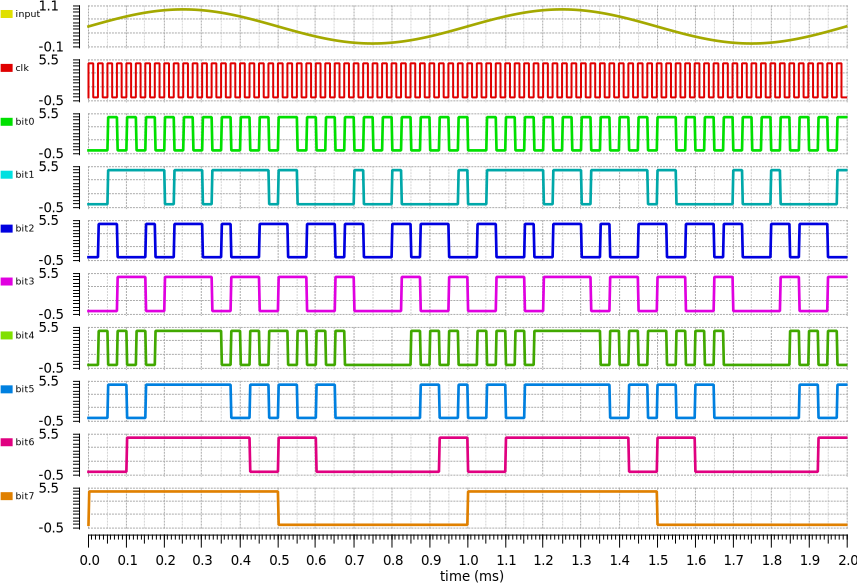

# Pipeline ADC

## Working Principle

The pipeline ADC consists of $N$ stages connected in series. Each stage
contains a sample-and-hold, 1-bit ADC (a comparator),  a summer, and a gain of
two amplifier.

Each stage of the converter performs the following operation:

1. After the input signal has been sampled, it is compared to
   $\frac{V_{REF}}{2}$. The output of each comparator is the bit conversion for
   that stage.

2. If $v_{in} > \frac{V_{REF}}{2}$ (comparator output is 1),
   $\frac{V_{REF}}{2}$ is subtracted from the held signal, and the residue is
   passed to the amplifier.

3. If $v_{in} < \frac{V_{REF}}{2}$ (comparator output is 0), the original input signal is
   passed to the amplifier.

3. The result from the summer is multiplied by 2 (so that the input range
   remains the same and we don't have to adjust the comparator) and result is
   passed to the sample-and-hold of the next stage.

## Simulation

Simulation was done using Spectre (from Cadence) and the output waveforms are
shown below.

