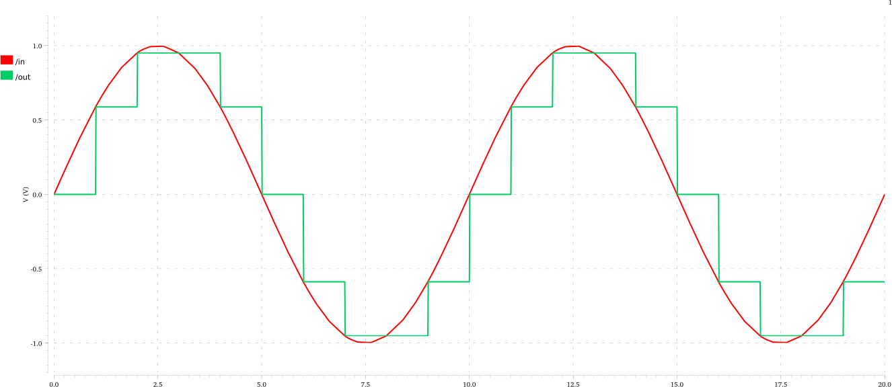

# Periodic Sample and Hold Circuit

## Working Principle

A periodic sample and hold samples its input at evenly spaced points and
produces an output that equals the value of the input at the most recent sample
point.

## Simulation

Simulation was done using Spectre (from Cadence) and the output waveforms are
shown below.

