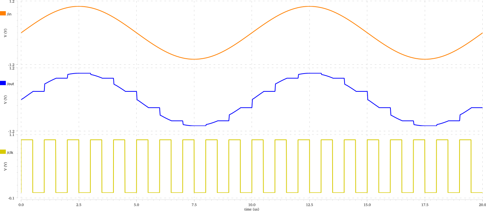

# Periodic Sample and Hold Circuit

## Working Principle

The input is tracked when the clock is HIGH, and held when the clock is LOW.

## Simulation

Simulation was done using Spectre (from Cadence) and the output waveforms are
shown below.

